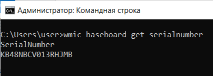
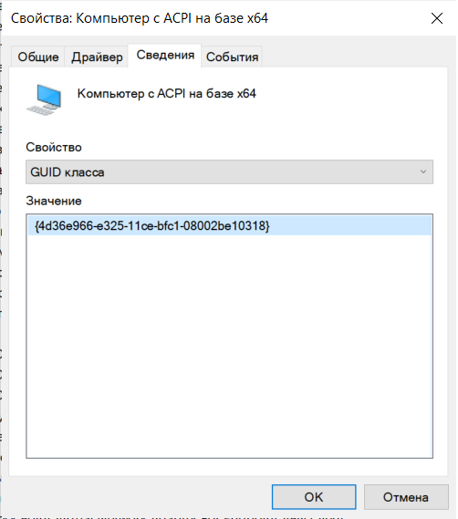

# Fingerprint viewer

### В рамках текущего проекта требуется

* Склонировать репозиторий и создать новую ветку в соответствии с решаемой задачей. \
Например, если задача реализовать `getBoardSerial`:

```sh
    git clone git@gitlab.com:SergeyJames/fingerprint_win.git
    cd fingerprint_win
    git checkout -b feature/getBoardSerial master
```

### Сборка

```sh
    mkdir build
    cd build
    cmake -G "Visual Studio 16 2019" ..
    cmake --build .
```

### Запуск

```sh
    Debug\fingerprint_win.exe
```

### Вывод (до имплементации)

```sh
    Not Implemented Yet.
    Not Implemented Yet.
    Not Implemented Yet.
```


* Вести всю разработку в текущей ветке.
* По необходимости добавить приватные методы в класс [Fingerprint](https://gitlab.com/SergeyJames/fingerprint_win/-/blob/master/include/Fingerprint.h#L8).
* Открыть [Merge requests](https://docs.gitlab.com/ee/user/project/merge_requests/) в ветку master.
* Когда локально все будет готово, необходимо сделать коммит с текстом "build_win64".\
Должна быть успешная сборка по примеру https://gitlab.com/SergeyJames/fingerprint_win/-/jobs/4595704207

</br>

#### Вся разработка ведется исключительно в среде Windows 10

</br>

#### Список решаемых задач:

* Реализовать логику getBoardSerial
* Реализовать логику getCPUSerial
* Реализовать логику getMAC


</br>

### Серийный номер сверить можно так

```sh
    wmic baseboard get serialnumber
```



Вполне сойдет и GUID



</br>
</br>
</br>